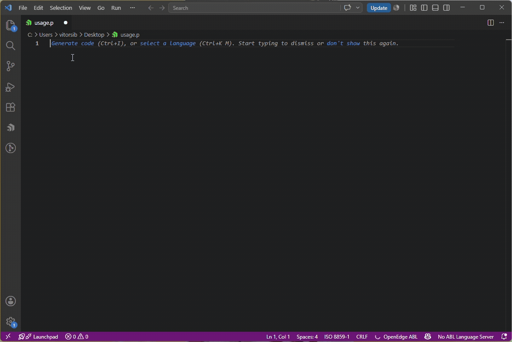

# OpenEdge ABL Uppercase Keywords

OpenEdge ABL Uppercase Keywords is a VS Code extension for Progress OpenEdge ABL developers. It automatically converts reserved words and known abbreviations to uppercase while you type.

## Why use this extension?

- Improves readability in legacy and modern OpenEdge codebases.
- Keeps coding style consistent across teams and projects.
- Reduces manual edits when writing ABL keywords.

## Features

- Auto-uppercase for Progress OpenEdge ABL reserved keywords.
- Supports standard ABL abbreviations defined in the keyword list.
- Works while typing with common delimiters (space and punctuation).
- Command Palette toggle to enable or disable behavior at any time.

## Installation

1. Open Extensions in VS Code.
2. Search for `OpenEdge ABL Uppercase Keywords`.
3. Install and reload.

Marketplace page:
https://marketplace.visualstudio.com/items?itemName=VitorPrimoSibin.openedgeuppercase

## Usage

1. Open an OpenEdge ABL file.
2. Type a reserved word in lowercase (for example: `define`, `for`, `find`).
3. Press space or punctuation.
4. The extension converts the keyword to uppercase.

## Command

- `OpenEdge ABL: Toggle Uppercase Keywords`

Use this command from the Command Palette to quickly enable or disable automatic uppercase conversion.

## Scope and limitations

- Target files: language `abl` and files ending in `.p`.
- The extension attempts to ignore comments and quoted strings.
- Conversion is based on the bundled keyword and abbreviation list.

## SEO keywords covered

This extension is designed for searches such as:

- Progress OpenEdge ABL VS Code extension
- OpenEdge keyword formatter
- Progress 4GL uppercase keywords
- ABL productivity tools for VS Code

## Support and feedback

- Issues and feature requests:
	https://github.com/VitorSibin/UpperCaseOpenEdge/issues
- Source code:
	https://github.com/VitorSibin/UpperCaseOpenEdge

## Changelog

See release notes in `CHANGELOG.md`.
